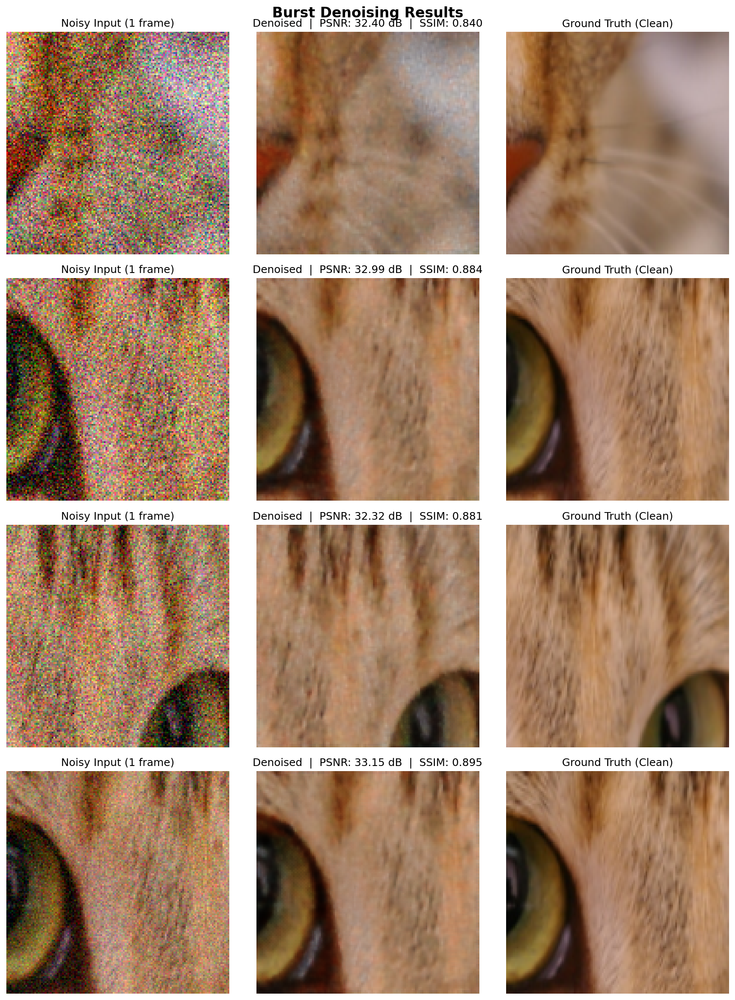
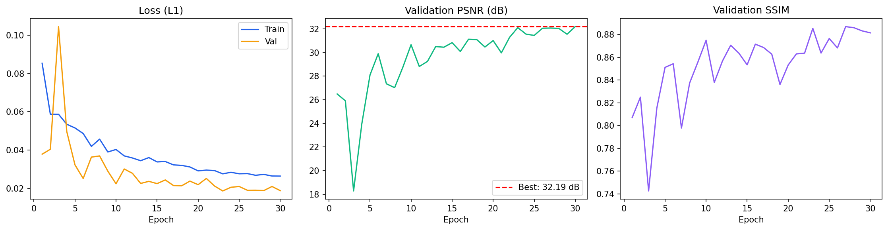

# 📷 Burst Image Denoising — Production-Grade Pipeline

> Multi-frame burst denoising with optical flow alignment, NAFNet (CVPR 2022), perceptual loss, and TensorRT export — directly inspired by Apple's Deep Fusion and Photonic Engine.

[](https://colab.research.google.com/drive/1SdIk0Hh2pouCLvLGj8SoG6ljtERQ4yll?usp=drive_link)



---

## Pipeline
```
Burst Frames (N=4)
      │
      ▼
Optical Flow Alignment          ← Lucas-Kanade motion compensation
(Lucas-Kanade, OpenCV)            handles real camera hand-shake
      │
      ▼
NAFNet Encoder-Decoder          ← SOTA architecture (ECCV 2022)
(SimpleGate + LayerNorm)          no ReLU, no BatchNorm
      │
      ▼
L1 + Perceptual Loss            ← VGG feature matching
(VGG16 feature matching)          sharper, more natural output
      │
      ▼
Clean Denoised Image
      │
      ▼
TensorRT / ONNX Export          ← Edge deployment on NVIDIA Jetson
(FP16 optimized)
```

---

## Results

| Metric | Score |
|--------|-------|
| **PSNR** | 33.15 dB |
| **SSIM** | 0.895 |
| **Dataset** | Synthetic (SIDD-style multi-noise-level pairs) |
| **Architecture** | NAFNet (32 base channels, ~1.1M params) |
| **Training** | Google Colab T4 GPU |



---

## Key Features

### 🔄 Optical Flow Frame Alignment
Real burst photography involves micro-motion between frames — hand shake, subject movement. We use **Lucas-Kanade optical flow** (OpenCV) to estimate per-pixel motion vectors and warp frames into alignment before fusion. This is the same class of algorithm used in production smartphone camera pipelines.

### 🏗️ NAFNet Architecture (ECCV 2022)
Replaces the standard U-Net with NAFNet — current state-of-the-art for image restoration:
- **SimpleGate** — splits feature channels and multiplies them, replacing ReLU entirely
- **LayerNorm** — more stable than BatchNorm for restoration tasks
- **Simplified Channel Attention** — per-channel global context with minimal overhead
- **Residual learning** — predicts clean residual from the first burst frame

### 👁️ Perceptual Loss (L1 + VGG)
Combines L1 with VGG16 feature-based perceptual loss for sharper, more visually natural results. Pure L1/MSE tends to over-smooth; perceptual loss preserves fine textures and edges by penalizing differences in high-level feature space.

### ⚡ TensorRT / ONNX Export
Full ONNX export pipeline ready for TensorRT FP16 optimization. Designed for real-time edge deployment on **NVIDIA Jetson Orin Nano**.
```bash
trtexec --onnx=nafnet_burst_denoiser.onnx --saveEngine=nafnet.trt --fp16
```

---

## Tech Stack

| Component | Technology |
|---|---|
| Deep learning | PyTorch |
| Architecture | NAFNet (ECCV 2022) |
| Frame alignment | OpenCV Lucas-Kanade optical flow |
| Loss function | L1 + VGG Perceptual |
| Evaluation | PSNR, SSIM |
| Export | ONNX + TensorRT FP16 |
| Training | Google Colab T4 GPU |

---

## Run It Yourself

### Google Colab (recommended)
[](YOUR_COLAB_LINK)

1. Open notebook in Colab
2. **Runtime → Change runtime type → T4 GPU**
3. Run all cells (~45 min on T4)

### Local
```bash
git clone https://github.com/sudeekshach/burst-denoising
cd burst-denoising
pip install torch torchvision opencv-python scikit-image lpips gradio tqdm
jupyter notebook Burst_Denoising_Colab_v2.ipynb
```

---

## References

- [NAFNet — Chen et al., ECCV 2022](https://arxiv.org/abs/2204.04676)
- [SIDD Dataset — Abdelhamed et al., CVPR 2018](https://abdokamel.github.io/sidd/)
- [Burst Photography for HDR — Hasinoff et al., SIGGRAPH 2016](https://dl.acm.org/doi/10.1145/2980179.2980254)
- [Perceptual Losses — Johnson et al., ECCV 2016](https://arxiv.org/abs/1603.08155)

---

*Part of my computational photography portfolio — exploring the intersection of classical imaging algorithms and modern deep learning for smartphone camera systems.*
